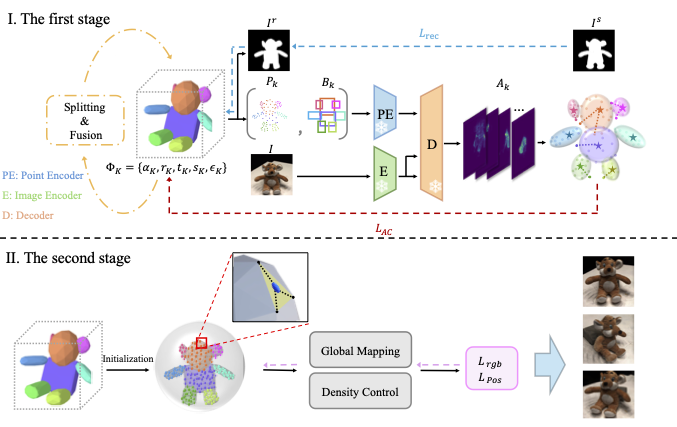

# GaussianBlock: Building Part-Aware Compositional and Editable 3D Scene by Primitives and Gaussians

Code for "*GaussianBlock: Building Part-Aware Compositional and Editable 3D Scene by Primitives and Gaussians*", In ICLR, 2025.

<div style="text-align:center;">
  
</div>

## The first stage

```bash
bash scripts/seq_pipeline.sh
```

## The scond stage
The code of Stage 2 is coming soon...

## Citation

```bibtex
@inproceedings{jiang2024gaussianblock,
  title={GaussianBlock: Building Part-Aware Compositional and Editable 3D Scene by Primitives and Gaussians},
  author={Jiang, Shuyi and Zhao, Qihao and Rahmani, Hossein and Soh, De Wen and Liu, Jun and Zhao, Na},
  booktitle={International Conference on Learning Representations},
  year={2025}
}
```